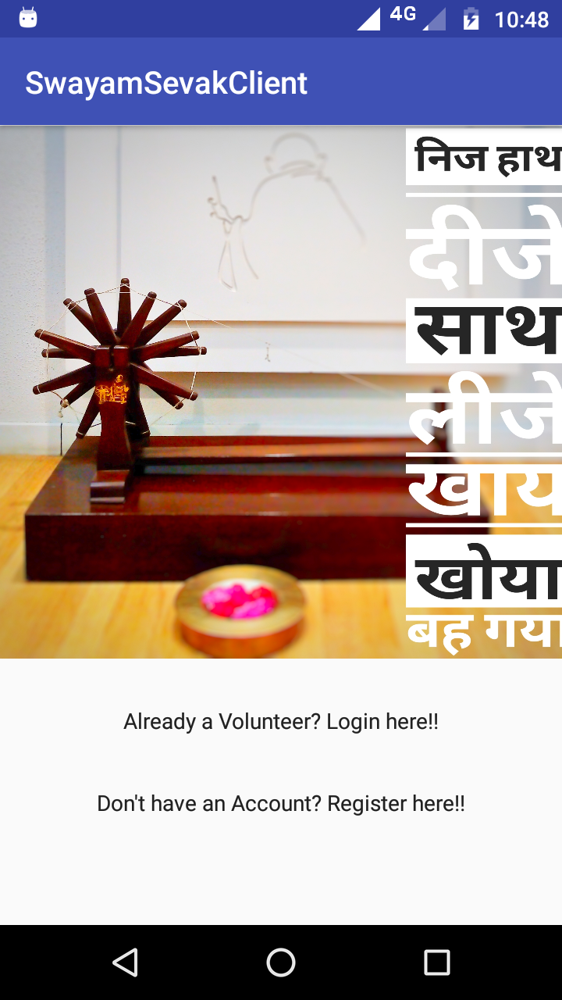
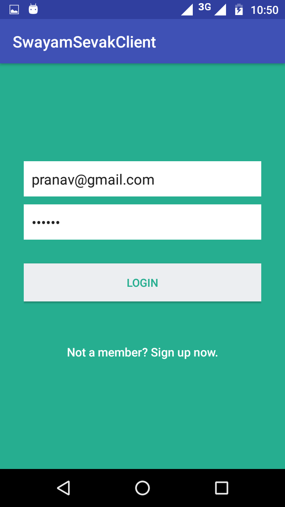
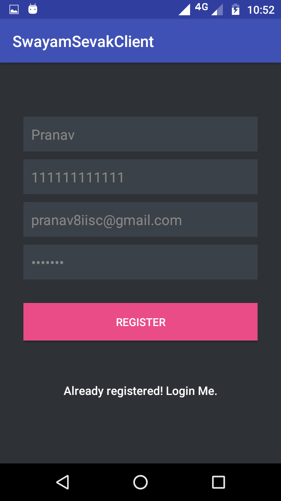
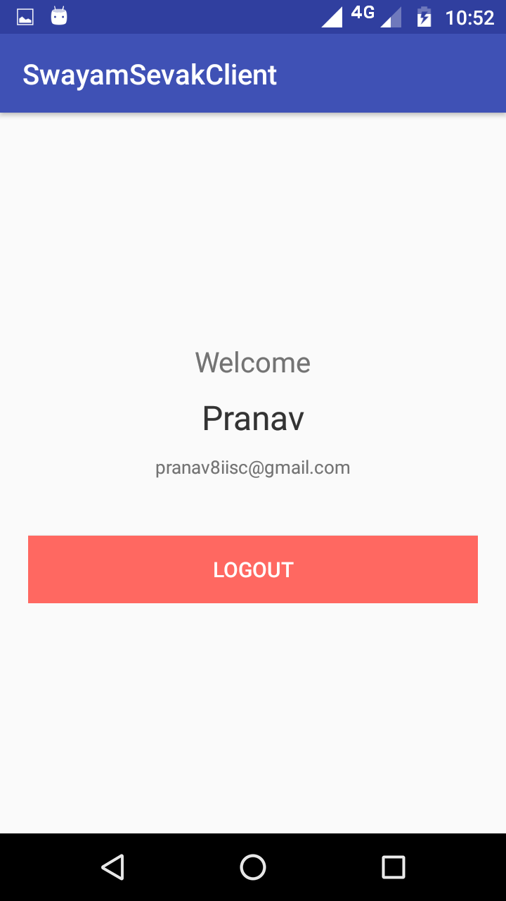
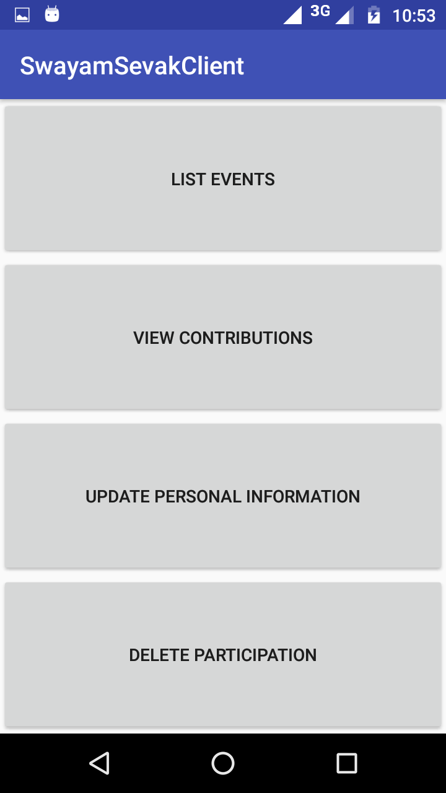

# SwayamSevak - An Android Application for Volunteering

## Synopsis

This android application is developed for volunteers to collect donations for various events viz. charity, natural disaster help drive, cultural or religious events and so on. Volunteers can login, view events as well as their contributions (past and ongoing), unsubscribe from a particular event etc.


<p></p>
<p></p>

<p></p>

<p></p>

<p></p>


## Planned features
* [ ] Potential donors can also login and can see all the upcoming events and can show interests for donating in a particuar event. 
* [ ] Management of all events, approving and removing volunteers by a Single authorized manager.
* [ ] Next place suggestion with Maps to the volunteers for collecting donations from different places.
* [ ] Various payment methods


## Getting Started

### Prerequisites
1. For configuring backend
   - Database Server: Mysql
   - PHP Server: 
   - Web Server: Apache
2. For building and installing android APK on your physical device 

### Installing

- Configuring Backend Server

  For creating database on server run the follwoing command on Mysql console
```create database.sql```

- Configuring GUI on Anroid emulator having atlleast SDK version 15 and above


### Deployment
Configure a php and mysql server and host the scripts in backend folder.


### Built  With
- [Android Studio 3.0](https://developer.android.com/studio/index.html)
- [PHP 7](http://php.net/downloads.php)
- [Mysql](https://dev.mysql.com/downloads/mysql/)

## Authors
Following are the list of contributors:
* Pranav Kant Gaur
* Shaleen Jain
* Wahdat Safia


